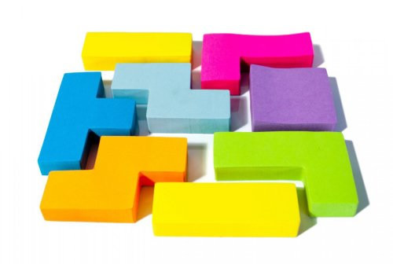

# kzjr_ui
> 空中金融pc端 ui组件

[ ](https://www.npmjs.com/package/kzjr_ui) 

<p align="center">
  <br>
  <br>
  
  <br>
</p>
                                            
<p align="center">
    🌾 <a href="http://chenxuan1993.gitee.io/air_finance_ui_documents/#/component/kzjr-button">online demo</a> 
</p>
                       
## 内容

- [**`浏览器兼容`**](#浏览器兼容)
- [**`安装`**](#安装)
- [**`使用`**](#使用)
    - [**`ES6`**](#ES6)
        - [**`按需加载`**](#按需加载)
        - [**`全部引入`**](#全部引入)
- [**`修改日志`**](#修改日志)                     

## 浏览器兼容
| [](http://godban.github.io/browsers-support-badges/)</br>IE | [](http://godban.github.io/browsers-support-badges/)</br>Firefox | [](http://godban.github.io/browsers-support-badges/)</br>Chrome | [](http://godban.github.io/browsers-support-badges/)</br>Safari | [](http://godban.github.io/browsers-support-badges/)</br>iOS | [](http://godban.github.io/browsers-support-badges/)</br>Android |
|:---------:|:---------:|:---------:|:---------:|:---------:|:---------:|
| IE9+ | &check;| &check; | &check; | &check; | &check; | &check;

## 安装

### NPM

```bash
npm install kzjr_ui --save
```

## 使用
### ES6

#### 按需加载
> 推荐
> 首先安装`babel-plugin-component`依赖

```javascript
npm install babel-plugin-component --save-dev
```

> 然后修改 .babelrc文件

```javascript
// .babelrc
{
  "presets": [["es2015", { "modules": false }]],
  "plugins": [
    [
			"component",
			{
				"libraryName": "kzjr_ui",
				"styleLibraryName": "kzjr_theme"
			}
		]
  ]
}
```
> 接下来，如果你只希望引入部分组件，比如 Button，那么需要在 main.js 中写入以下内容：

```javascript
import Vue from 'vue';
import { Button } from 'kzjr_ui';
import App from './App.vue';
 Vue.use(Button)
/* 或写为
*Vue.component(Button.name, Button);
*/
new Vue({
  el: '#app',
  render: h => h(App)
});
```

#### 全部引入
> 不推荐

```javascript
import Vue from 'vue';
import KzjrUI from 'kzjr_ui';
import 'kzjr_ui/lib/kzjr_theme/index.css';
import App from './App.vue';

Vue.use(KzjrUI);

new Vue({
  el: '#app',
  render: h => h(App)
});
```

## 修改日志
See the GitHub [查看历史版本](https://github.com/kzjr-ui/kzjr_ui/releases).

## License
vue-seamless-scroll is open source and released under the [MIT License](LICENSE).